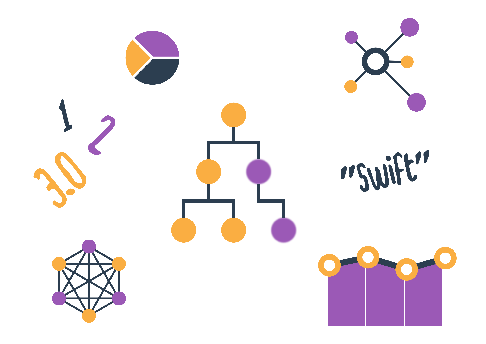
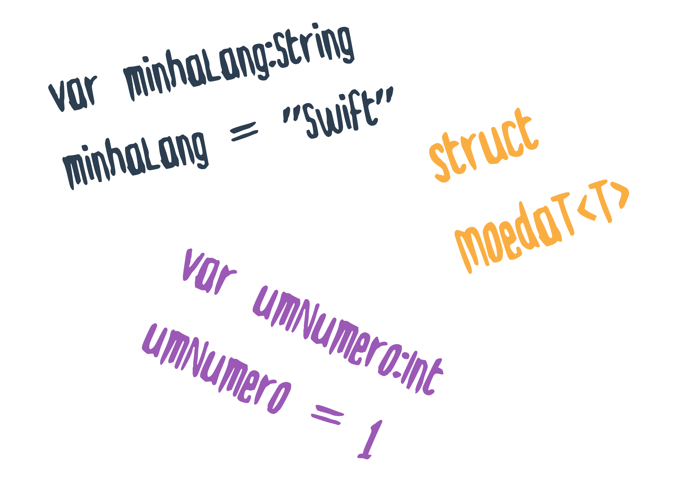
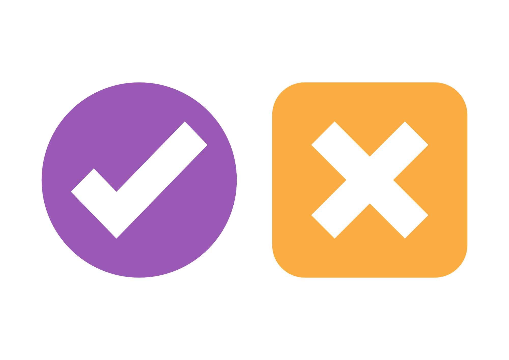
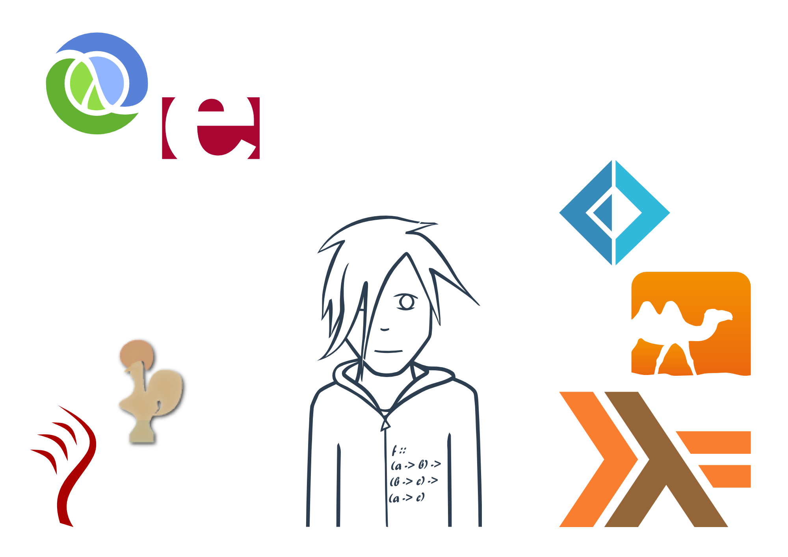
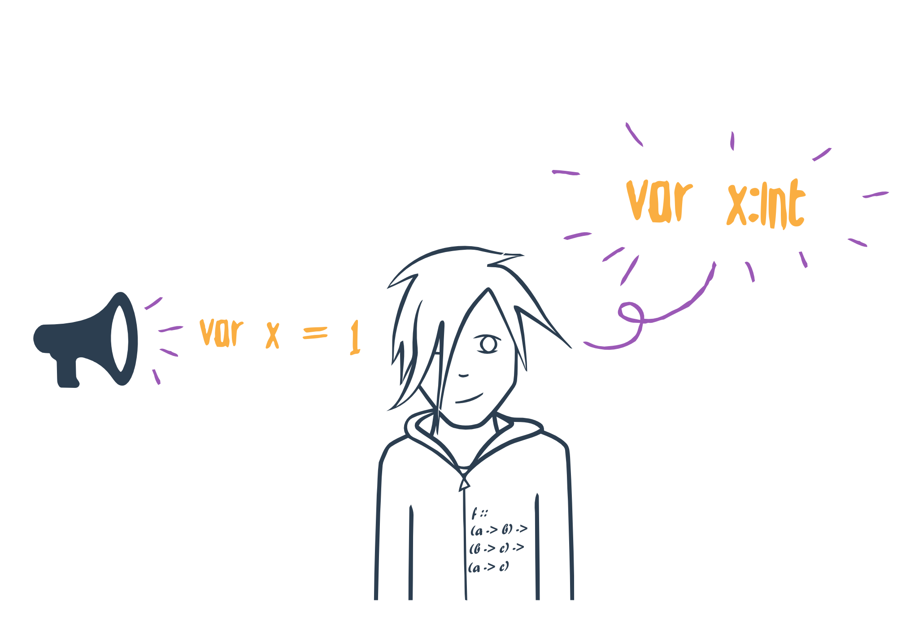
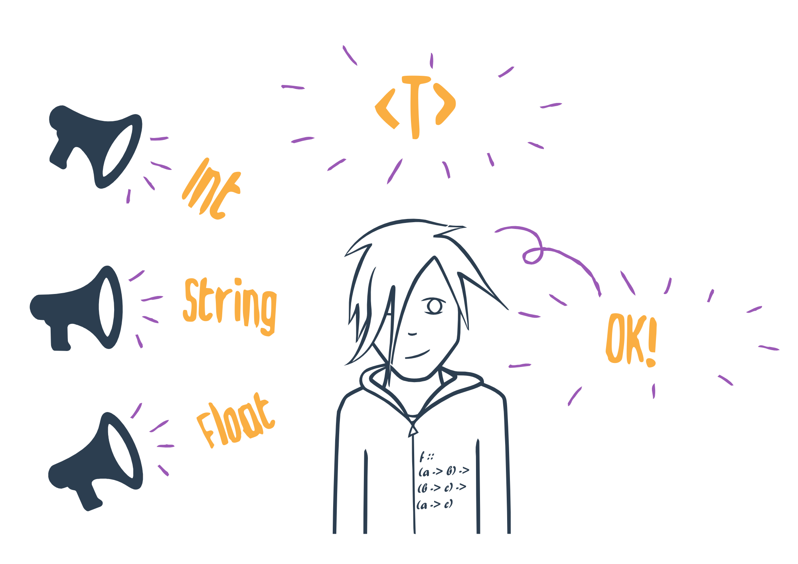

> Antes de tudo, algumas coisas a se levar em consideração:

1.   Esse post é baseado em experiências - e eu não sou nenhum tipo de *dono da
verdade*: se você tem alguma opinião sobre isso - concordando, discordando,
complementando -, sinta-se livre para compartilhá-la.

1.   Nem tudo nesse post é sobre Swift: boa parte dele está relacionada a
experiências bem gerais relacionadas a projeto de linguagens de programação.

1.   Há boatos que a experiência de ler o post é enriquecida ouvindo-se o álbum
[Sgt. Pepper's Lonely Hearts Club Band](https://play.spotify.com/album/6QaVfG1pHYl1z15ZxkvVDW) ☺️.

## Prólogo

> Algumas coisas que me levaram a pensar sobre *Sistemas de Tipos* - e a escrever
esse post...

Eu, [Matheus](https://github.com/ythecombinator), sou originalmente desenvolvedor
JavaScript. E, como em outras linguagens, tenho de lidar com alguns *probleminhas*.
Por exemplo, sua tipagem dinâmica pode ser problemática: JavaScript não sabe
que tipo uma variável é até que esta seja realmente atribuída em execução - o
que significa que pode ser tarde demais, uma vez que você não sabe se algum
erro de tipo estava em seu código e quebrou antes de executá-lo.

Além disso, nós não podemos contar com caras como o `instanceof` e o `typeof`:
eles não funcionam de forma consistente - o que acaba nos mostrando que
verificação de tipos em JavaScript é um problema - e você provavelmente tem que
fazer alguns *workarounds* para ajudar você a superar tal inconsistência - ou
usar caras como o [TypeScript](http://www.typescriptlang.org/) ou o
[Flow](http://flowtype.org/).

O que tudo isso tem a ver com Swift? Bem, o contato com algumas inconsistências
relacionadas a tipos presenciadas em algumas linguagens - bem como sistemas de
tipos exemplares que pude experimentar em linguagens como
[Haskell](https://www.haskell.org/), [OCaml](https://ocaml.org/) e
[F#](http://fsharp.org/)- me fez ter sempre tal tópico em mente ao começar em
uma linguagem - e, há alguns meses, quando comecei a estudar a linguagem
da Apple, não foi diferente.

## Mas Antes...

... de começarmos a ver coisas específicas de Swift relacionadas a seu
sistema de tipos, penso que seja interessante fazermos um *apanhado* de
alguns conceitos mais "gerais".

### Dados?



Esse é um conceito bem primitivo - e que muitas vezes não é discutido e só
aceito. Na *Filosofia*, temos uma definição parecida com isso:

> Coisas conhecidas ou assumidas como *fatos*, tornando-se a *base do raciocínio
ou cálculo*.

Ao adentrarmos na *Computação*, começamos a pensar de uma forma ou pouco
diferente sobre *dados* - ou melhor dizendo: um pouco mais *específica* para o
contexto em que estamos - e encontramos definições como:

> *Quantidades*, *caracteres* ou *símbolos* dos quais operações são executadas
por um computador, sendo armazenados e transmitidos na forma de sinais
eléctricos e gravados no suporte de gravação magnética, óptica ou mecânica.

E assim, começamos a pensar mais sobre dados como sendo um determinado pedaço de
informação - *textos*, *números*, *listas*, *figuras* etc.: são todos pedaços de
informação.

E, como podemos ler no famigerado
[*Livro do Mago*](https://mitpress.mit.edu/sicp/full-text/book/book.html):

> [...] *Processos computacionais* são seres abstratos que habitam computadores.
À medida que evoluem, os processos manipulam outros seres abstratos chamados
**dados**. A evolução de um processo é dirigida por um padrão de regras chamado
*programa*. As pessoas criam programas para direcionar processos. [...]

Dados são uma das partes mais importantes da arte de programar.

E, particularmente, eu diria que a conversa começa a ficar mais legal quando
pensamos sobre como essas informações são passadas a um computador - afinal,
eles não sabem o que um *número* é, ou o que o *infográfico de seu documento*
é, ou o que a *URL* da sua página é - e assim por diante.

Então chegamos a - já esperada - conclusão de que, se queremos passar a nosso
computador qualquer um desses *pedaços de informação*, precisamos saber
representá-los de alguma maneira que o computador entenda.

Guarda bem essa palavra: **representação** - pois ela nos leva ao próximo
tópico.

### Tipos de Dados?



> **tl;dr**: Uma representação específica de algum(ns) dado(s).

Basicamente, essa galera aqui te diz como interagir com um determinado
*pedaço de informação* e ainda pode dizer como essa informação (dado) é
representada por meio de outras informações mais primitivas - ou *vice-versa*:
como interpretar dados mais primitivos a partir de um determinado tipo de dados.

Se o ato de programar consiste em gerenciar processos de tal forma que eles
possam manipular dados, **é de importância crucial que tais processos manipulem
dados de forma eficiente e correta**.

Seguindo o raciocínio, modelar dados de forma que estes possam ser *manipulados
de forma eficiente e correta* é uma parte essencial de todas as tarefas de um
programador - e os tipos de dados são essenciais para tal modelagem - assim,
temos neles a **importantíssima** tarefa de garantir que as interações
com um determinado *pedaço de informação* estejam sempre corretas.

A propósito, guarde bem, também, essa palavra: **correto** - pois ela ainda será bem
discutida mais a frente.

### Sistemas de Tipos?


> **tl;dr**: Sistemas do tipo são, em sua essência, estruturas de análise de
programas.

Soa confuso? É, realmente pode ser *bem* confuso.

Que tal pedirmos ajuda aos universitários?

Bem, [Benjamin Pierce](http://www.cis.upenn.edu/~bcpierce/), em seu livro
[Types and Programming Languages](https://www.cis.upenn.edu/~bcpierce/tapl/),
nos conta que:

> Um sistema de tipos é um método sintático tratável para provar o não
cumprimento de certos comportamentos do programa através da classificação de
*expressões* de acordo com os tipos de valores que estas computam.

Eu diria que uma das chaves para entendermos o tópico é o trecho:

> [...] provar o não cumprimento de certos comportamentos do programa [...].

a partir do qual podemos ver que, para todo sistema de tipos específico,
haverá uma lista de coisas que este visa a provar - do que exatamente consiste
tal prova é deixado em aberto.

Uma forma prática de tentar enxergar isso é pensar em simples expressões. Por
exemplo, uma vez que o verificador de tipos pega a expressão `1 + 2`, este pode
"olhar" para o `1` e inferir que se trata de um inteiro, olhar para o `2` - e
também inferir que este é um inteiro - e, em seguida, olhar para o operador
`+`, e saber que, quando `+` é aplicada a dois inteiros, o resultado é um
número inteiro - e aí temos nossa prova.

### *Correctness-by-Design*



Esse conceito aqui também é sempre legal de se pensar sobre, garanto.

Um dos principais objetivos de uma linguagem de programação deve ser a
capacidade de orientar o programador a uma abordagem de *Correctness-by-Design*.
Isto é, um programa que é válido nesta linguagem, também deve ser um programa
que funciona como o esperado - ou seja: o sistema simplesmente não poderá chegar
a um estado inválido; um estado que não cumpre os requisitos de tal programa.

Para tanto, a linguagem deve fazer um esforço de rejeitar programas que possam
estar errados - ou, ao menos, torná-los mais difíceis de escrever. Assim,
você literalmente não pode escrever código incorreto pelo simples fato de o
compilador não deixar.

### *Correctness-by-Design* & Sistemas de Tipos


Agora que já temos uma ideia geral em torno de sistemas de tipos e de como
linguagens devem ser projetadas de modo a naturalmente evitar que programas
feitos nestas atinjam estados inválidos, você deve estar se perguntando: qual é
a exata relação entre ambos?

Sinceramente, eu gostaria de ter uma relação própria já estabelecida tão
expressiva quanto a feita pelo ilustre pesquisador
[Luca Cardelli](http://lucacardelli.name/), da
[Microsoft Research](http://research.microsoft.com/en-us/default.aspx):

> O propósito fundamental de um sistema de tipo é **evitar a ocorrência de
erros durante a execução de um programa**.

Ainda subjetivo? Ele vai além:

> Sistemas de tipos fornecem ferramentas conceituais para julgar a adequação
de aspectos importantes de definições da linguagem. Descrições de linguagem
informais muitas vezes não conseguem especificar a estrutura de tipos de uma
linguagem com detalhes suficientes de maneira a evitar a aplicação equívoca.
Muitas vezes, acontece que diferentes compiladores para a mesma linguagem
implementam sistemas de tipo ligeiramente diferentes. Além disso, muitas
definições de linguagens se mostraram ser defeituosas no quesito tipos,
permitindo que um programa quebre - mesmo sendo considerado aceitável por um
*typechecker*.

Assim, vemos no nosso sistema de tipos a figura responsável por *"julgar a
adequação de aspectos importantes das definições de uma linguagem"*, de forma
a *"evitar a escrita de código incorreto pelo simples fato de o compilador não
deixar"*.

### O Que Temos Por Aí?



Esta seção serve mais para contextualizar Swift entre outras linguagens antes
de falarmos especificamente desta.

As linguagens se dividem em duas categorias: **tipadas** e **não-tipadas** - ou
*unitipadas*.

> *Bônus*: Até a forma como pensamos na definição de tipos pode variar dentro
desse espectro, mas isso é tema para outras discussões - e vamos manter a nossa
definição alcançada nas seções anteriores.

Na primeira, temos representantes como *Haskell*, *OCaml*, *F#*, entre muitas
outras, incluindo nossa querida *Swift*. Nestas, as expressões têm tipos
diferentes, e quando se combina uma expressão particular, os tipos devem estar
coerentes - assim, se você tem uma expressão `Int` + `Int`, não é possível
escrever `"Swift"` + `1`, porque `"Swift"` não tem o tipo `Int`.

Na segunda, também temos representantes de peso, como: *Clojure*, *Erlang* e
*Scheme*. Nestas, todas as expressões têm o mesmo tipo, portanto, não há
restrições em como as expressões podem ser combinadas - assim, a mesma expressão
do exemplo anterior seria um construção válida, pois seria uma expressão do tipo
`Object` + `Object` - ou algo assim.

Atualmente - até onde eu sei - exemplos que temos de mais poderosos e
expressivos em relação a sistemas de tipos são os de
[Agda](http://wiki.portal.chalmers.se/agda/pmwiki.php),
[Idris](http://www.idris-lang.org/) e [Coq](https://coq.inria.fr/), que possuem
tipagem dependente e indutiva - programar nestas é realmente uma experiência
incrível de interação com seu *typechecker*.

Um pouco mais abaixo - mas ainda proporcionando lindezas relacionadas a tipos -
temos aquelas que se baseiam em variações do modelo *Hindley–Milner* - do qual
você pode achar uma explicação bem interessante [aqui](http://akgupta.ca/blog/2013/05/14/so-you-still-dont-understand-hindley-milner/) -, como *Haskell*, *ML*, *OCaml*,
[Rust](https://www.rust-lang.org/), [Scala](http://scala-lang.org/) e...
*Swift*.

Ainda sobre classificações, temos que *Swift* é:

- **Estaticamente Tipada**: Ou seja, todas as suas *variáveis*, *constantes*,
*funções* etc. devem ter seus tipos declarados - ou inferidos, como veremos mais
adiante - antecipadamente. Então o compilador, ao compilar seu programa, usa
essas declarações de tipo para verificar se não há erros. Se houver um erro de
tipo, o programa não será compilado.

```swift
var x: Int = 5
x = "Swift" // => Aqui temos um erro
```

- **Fortemente Tipada**: O que nos diz que, sempre que você usar uma variável,
ou passar algo como um argumento de uma função, Swift irá verificar, em tempo
de compilação, se este é do tipo correto - assim você não pode, por exemplo,
passar um `Float` para uma função que espera um `Int`.

```swift
// Uma simples função que retorna o fatorial de um valor.

// Pela anotação de tipo, temos que fatorial recebe um `Int` e o mapeia para
// um `Int`.

func fatorial(n: Int) -> Int {
  return n == 0 ? 1 : n * fatorial(n — 1)
}
// Chamando nossa função com um `Int`, teremos um `Int` de retorno.
fatorial(3)   // => 6

// Chamando nossa função com um `Float`, teremos um erro.
fatorial(3.0) // => Erro.
```

E agora...

## Vamos Falar de Swift?

> *Ufa, finalmente! Um post intitulado "Swift In The Sky With Types" e até
agora nada demais sobre Swift?!*

Agora, gostaria de levantar algumas coisas que vão além do que vimos na seção
anterior.

### *Type-Safety*


Como podemos encontrar na própria [documentação provida pela Apple](https://developer.apple.com/library/ios/documentation/Swift/Conceptual/Swift_Programming_Language/TheBasics.html#//apple_ref/doc/uid/TP40014097-CH5-ID309):

> Swift é uma linguagem *type-safe*, o que significa que a linguagem ajuda você a
ser claro sobre os tipos dos valores com os quais seu código pode trabalhar. Se
parte do seu código espera uma `String`, a segurança de tipos impede que você
possa, por engano, passar um `Int`.

Assim, sabemos que **todas** as variáveis têm um tipo declarado e **todas** as
funções/métodos têm assinaturas de tipo que declaram os tipos de seus argumentos
e retornos. E por fim, o nosso amigo compilador verifica se todos os seus tipos
estão coerentes e não compila seu programa caso não estejam - erros em tempo de
compilação são 💖.

> *Bônus*: Swift nos permite definir várias "versões" de uma mesma função, só
que com diferentes assinaturas de tipos - e a "versão" que será chamada
será aquela cujos argumentos forem compatíveis com a assinatura de tipo -
inclusive, há um monte de coisas legais relacionadas à Swift e seu suporte a
polimorfismo Ad-hoc.

```swift

// Uma simples função que retorna o fatorial de um valor.

// Pela anotação de tipo, temos que fatorial recebe um `Int` e o mapeia para
// um `Int`.

func fatorial(n: Int) -> Int {
  return n == 0 ? 1 : n * fatorial(n — 1)
}

// Agora, pela anotação de tipo, temos que fatorial recebe um `Float` e
// mapeia este para um `Float`.

func fatorial(n: Float) -> Float {
  return n == 0.0 ? 1.0 : n * fatorial(n — 1.0)
}

// Chamando nossa função com um `Int`, teremos um `Int` de retorno.
fatorial(3)   // => 6

// Chamando nossa função com um `Float`, teremos um `Float` de retorno.
fatorial(3.0) // => 6.0
```

### *Type Inference*



Se você é daqueles que se assusta com a possibilidade de ter que declarar tipo
de cada variável do seu código, relaxe! Swift usa a inferência de tipos
para - <strike>adivinha?</strike> - inferir quais os tipos suas variáveis têm.
Caso queira, você pode declarar explicitamente o tipo de suas variáveis, mas,
na prática, muitas vezes você não precisa: Swift irá inferir o tipo de uma
`var` se você atribuir a ela um valor inicial.

```swift
// Aqui, inicializamos uma variável `x`, dando a esta o valor `1`. Como
// fornecemos um valor inicial, não precisamos declarar explicitamente o tipo
// de `x`: Swift irá inferir que esta se trata de um `Int`.
var x = 1

// Desta vez, declaramos uma variável, mas sem atribuir valor a esta - assim,
// Swift não pode inferir seu tipo e precisamos definir este explicitamente.
// Logo após a declaração, atribuímos a ela o valor `2` - e caso atribuíssemos
// um valor de tipo não coerente com a declaração, teríamos um erro do compilador.
var y:Int
y = 2
```

### *Generics*



Os conhecidos *Generics* nos permitem declarar uma variável que, na execução,
pode ser atribuído a um conjunto de tipos definidos por nós.

Em Swift, um *array* pode conter dados de qualquer tipo: ao criarmos um *array*
de `Int`s, `Float`s ou `String`s, por exemplo, o tipo dos valores que este vai
carregar é definido quando o mesmo é declarado - e assim, temos neles um bom
exemplo do uso de *Generics*.

O uso destes começa com **funções genéricas**, como uma simples função para
imprimir elementos de um array:

```swift
// Funções genéricas usam placeholders ao invés de um tipo real, como `String`,
// `Int` ou `Float`. Em nossa função, o placeholder é `T` - mas poderia ser
// qualquer outro: `T` é "apenas" convenção.

// O uso do placeholder não indica que a função aceita um tipo `T` mas sim que
// `T` será substituído por um tipo real que é determinada quando a função é
// chamada.

func imprimeElementos<T>(a: [T]) {
    for elemento in a {
        println(elemento)
    }
}
```

E a brincadeira com estas pode ir além: poderíamos, por exemplo, ter algo do tipo:

```swift
func minhaFuncao<T, U>(a: T, b: U) {}
```

Onde especificamos mais de um *Generic*.

Porém, a diversão não para nas funções genéricas: temos os tipos genéricos!
Estes são, basicamente, *classes*, *enumerations* e *structs* que trabalham com
qualquer tipo - se você se lembrou de *array*s e *dictionaries*, você pegou a
ideia.

Assim, podemos ter coisas como:

```swift
// Um exemplo de necessidade comum, por exemplo, é obter um valor randômico de
// uma coleção - e podemos implementar isso com Generics!

// Temos uma estrutura que é genérica sobre o tipo `T`.
struct MinhaColecao<T> {

    // Temos uma propriedade, um array do tipo T para armazenar o conjunto de
    // dados passados durante a inicialização.
    let itens: [T]

    init(itens: [T]) {
        self.itens = itens
    }

    // E, por fim, temos uma função genérica que cuida do resto :)
    func geraAleatorio() -> T {
        let indice = Int(arc4random_uniform(UInt32(itens.count)))
        return itens[indice]
    }
}
```

E, ao testarmos:

```swift
let teste = MinhaColecao(itens: ["s", "w", "i", "f", "t"])
teste.geraAleatorio() // => "f"
```

## Concluindo

> Falou quase nada de Swift!

É... Verdade! Perto do que se tem a ser dito, não foi dito quase nada de nada.
Cada um desses tópicos sobre Swift - até os mais primitivos -, juntamente com
alguns que não explorei para evitar textão - como *Phantom Types*,
*Typeclasses* etc. - renderia/mereceria um post ou talk sobre. E com os tópicos
mais teóricos discutidos no post não é muito diferente - de fato, é sim: estes
é que renderiam/mereceriam mais posts e talks para serem discutidos!

Na verdade, o objetivo maior do post é apenas levantar cada um destes tópicos em
sua mente - e o fazer pensar e buscar mais sobre eles.

> Eu realmente ganho algo?

Você pode ainda estar se perguntando se todas estas palavras relacionadas à
teoria dos tipos - e outras áreas de estudo comumente associadas a projeto e
implementação de linguagem - que soam algo muito *apenas da Academia* realmente
afetam a forma como você escreve aplicações do mundo real; para resolver
problemas reais.

Bem, eu confesso que, quando comecei a interessar mais por esse assunto, também
tinha muitos pensamentos assim - algo do tipo: *"Poxa, até ontem eu escrevia
código que funcionava e não entendia nada disso! Não vai ser agora que vou
precisar"*.

O que eu não me ligava muito era que a formo como eu modelo meus dados afeta -
e muito! - a forma como eu interajo com estes. E:

- Poder deduzir o que uma função faz a partir de sua assinatura de tipo - algo
inclusive muito útil para tornar o código mais legível e compreensível -;

- Ter o processo de refatoração facilitado, uma vez que conto com um monte de
erros de compilação para me dizer onde as coisas começaram a dar errado;

- Ter a garantia que as relações entre meus dados estão ocorrendo da forma que
deveriam.

São etapas que, diria eu, são necessárias para se atingir a coerência requerida
para se interagir corretamente com uma informação - e isso, colega, causa
grande impacto no seu software final.

> Poxa, agora o compilador será meu inimigo?

**tl;dr**: De forma alguma, galera.

A priori, pode soar <strike>muito chato</strike> doloroso travar uma *"luta"*
contra um *typechecker* apenas para ver um programa que você **tem certeza de
que está correto** compilado. Alguns chegam até a ver como uma péssima
característica da linguagem se pensarmos em um conceito de *bom* para uma lang
definido através da métrica "ser *developer-friendly*".

Porém, um ponto que eu penso ser interessante de se discutir é o fato de que a
noção técnica de *melhor* envolve aspectos - estes indo muito além do sistema
de tipos, como: seu modelo de execução, o quão segura esta é, maneiras que se
usa pra obter melhor expressividade - que nem sempre, **à primeira vista**, se
alinham com a felicidade do desenvolvedor.

Particularmente, o tempo me mostrou que, ao programar em uma linguagem que me
faça pensar cuidadosamente sobre tipos, acabo chegando a um código melhor
projetado, mais fácil de manter, que falha mais rápido - caso este haja de
falhar, claro -, melhor documentado etc. Assim, passei a ver o compilador não
como um inimigo, mas como uma ferramenta que me guia de uma bela forma a
solução para o meu problema - através de tipos.

E tudo isso faz você se sentir bem mais confiante sobre seu próprio código - e
isso é tão divertido quanto ouvir a faixa *Lucy In The Sky With Diamonds* ☺️.

## Referências

Aqui ficam apenas alguns posts, livros, vídeos etc. nos quais me baseei ao
longo da escrita deste post - e que eu acho que mereceriam um tempo da atenção
de vocês.

-   [**Hole-driven Haskell**](https://www.youtube.com/watch?v=52VsgyexS8Q&feature=youtu.be)

    *Screencast* por [Matthew Brecknell](http://matthew.brecknell.net/).

-   [**May Your Data Ever Be Coherent**](https://www.youtube.com/watch?v=gVXt1RG_yN0)

    *Talk* por [Daniel Spiewak](http://www.codecommit.com/blog/).

-   [**On Understanding Types,Data Abstraction, and Polymorphism**](http://lucacardelli.name/papers/onunderstanding.a4.pdf)

    Artigo por [Luca Cardelli](http://lucacardelli.name/).

-   [**Structure and Interpretation of Computer Programs**](https://mitpress.mit.edu/sicp/full-text/book/book.html)

    O famoso *Livro do Mago* é sempre uma referência!

-   [**The Swift Programming Language (Swift 2.2) - The Basics**](https://developer.apple.com/library/ios/documentation/Swift/Conceptual/Swift_Programming_Language/TheBasics.html)

    Documentação oficial provida pela Apple.

-   [**Type Systems**](http://lucacardelli.name/Papers/TypeSystems.pdf)

    Artigo por [Luca Cardelli](http://lucacardelli.name/).

-   [**Types and Programming Languages**](https://www.cis.upenn.edu/~bcpierce/tapl/)

    Livro de [Benjamin Pierce](http://www.cis.upenn.edu/~bcpierce/).